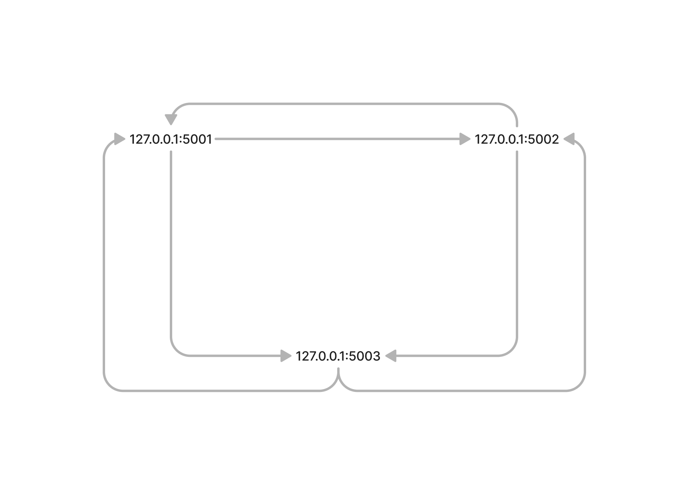

## Steps to work with this crypto currencies and explanations:
1. Go to SPIDER or any other python editor/IDE.
2. Run these 3 files: 1. strangecoin_node_5001.py, strangecoin_node_5002.py and strangecoin_node_5003.py
3. Now in our localhost (127.0.0.1), we are using 3 ports (5001, 5002, 5003).
4. These 3 ports act as a 3 nodes in a network.
5. These 3 nodes are not connected until now.
6. Once it is connected, we are in a connected network like a complete graph.

## Endpoints:
1. /get_chain - to get entire chain of that particular node.
2. /connect_node - to connect the nodes to form a network.
3. /mine_block - to mine a new block in a node.
4. /replace_block - to replace the longest chain of network to that node.
5. /add_transaction - to add a new transaction in a node.

1. In transaction.json,
===> Don't put empty string, enter sender, receiver name and amount. But in real transaction, we use sender and receiver's public key.
